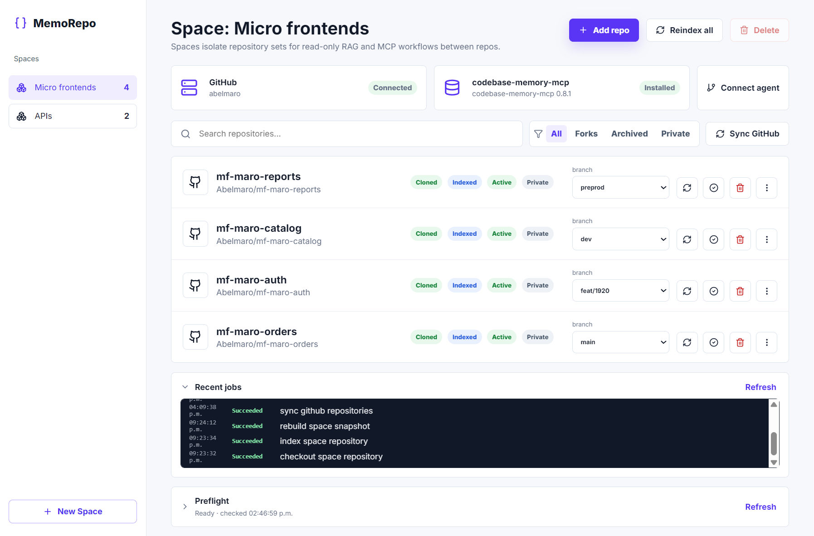

# MemoRepo

MemoRepo is a local-first dashboard for building isolated repository spaces, indexing them with `codebase-memory-mcp`, and exposing each space to coding agents through a read-only MCP gateway.

MemoRepo is meant to be run by one developer or one local workstation environment. It manages local clones, builds immutable code graph snapshots, and gives coding agents a narrow MCP interface over those snapshots.



## Requirements

- Docker Desktop
- A 43-128-character URL-safe control token in `MEMOREPO_CONTROL_TOKEN`, generated from at least 32 random bytes

MemoRepo uses GitHub's Device Flow for its single local user by default. Official builds include MemoRepo's public OAuth Client ID, so users do not register an application or configure a client secret. An existing personal access token can instead be supplied through `GH_TOKEN`.

## Supported Local Environments

The supported runtime target is Docker Compose on:

- Windows with Docker Desktop
- macOS with Docker Desktop
- Linux with Docker Engine or Docker Desktop

Running the Node workspaces directly is intended for development. Productive local use should go through Docker Compose so the API, dashboard, `git`, and `codebase-memory-mcp` runtime stay consistent.

Direct Node development requires `codebase-memory-mcp` v0.9.0 on `PATH`. On first use of each snapshot cache, MemoRepo verifies that both `auto_index` and `auto_watch` are disabled, enforces those values when necessary, and fails closed if the installed runtime cannot report or retain them. The Docker image pins the supported release.

## Run

For a first productive setup, follow [docs/quickstart.md](docs/quickstart.md).

```bash
cp .env.example .env
```

Set `MEMOREPO_CONTROL_TOKEN` in `.env`. Optionally set `GH_TOKEN` to use an existing GitHub token without OAuth login, then run:

```bash
docker compose up --build
```

Open the dashboard:

```text
http://127.0.0.1:5173
```

Unlock the dashboard and open **System health**. If `GH_TOKEN` is empty, choose **Sign in with GitHub**; otherwise MemoRepo uses the token from `.env` and does not request OAuth login.

Persistent local state lives under `MEMOREPO_HOME`. Docker Compose uses the `memorepo-data` named volume for new installations to avoid host bind-mount overhead during indexing; existing `.env` files without `MEMOREPO_STORAGE` keep using their configured `MEMOREPO_HOME` bind mount.

For direct Node development, prefer setting `MEMOREPO_HOME` to a path outside this repository so managed clones, indexes, and SQLite state do not sit next to the source tree.

### Performance baseline

The baseline runner exercises the production API with two spaces, three sequential repository additions per space, an optional three-agent concurrency probe, and an idle dashboard event-stream sample. It records timings, job counts, usage totals, normal HTTP request aggregates, dashboard stream connections, events, heartbeats, bytes, and storage growth without retaining repository locators, event payloads, prompts, responses, tool payloads, or managed paths. Reports are written under the operating system temporary directory by default.

Start MemoRepo with an empty `MEMOREPO_HOME`, then run:

```bash
pnpm perf:baseline -- --repositories owner/one,owner/two,owner/three --include-agents
```

Use `--idle-seconds 0` for a fast pipeline-only run or `--output <path>` to choose another report location. `MEMOREPO_PERF_REPOSITORIES` can provide the three comma-separated locators without adding them to shell history. The idle sample opens the same authenticated SSE stream as the dashboard and observes it for the configured duration. Stream lifetime and byte metrics are reported separately so the long-lived connection does not distort normal HTTP latency. The runner does not launch a browser and therefore does not include browser-generated CORS preflights.

## Ask this Space

Each space includes an optional **Ask this Space** panel. `AgentService` coordinates chats with the in-process `agent-runtime`, whose adapter uses the Pi SDK. Open the panel from the floating launcher, choose an available OAuth-capable provider and model, then complete that provider's authorization flow.

Before connection, the panel requires explicit consent to send questions, chat history, snapshot query results, and relevant code excerpts to the selected provider for inference. Repository-access credentials and the MemoRepo control token are not included in model prompts or tool request/result payloads.

The initial selection comes from `MEMOREPO_AGENT_PROVIDER_ID` and `MEMOREPO_AGENT_MODEL_ID`; `.env.example` starts with `openai-codex` and `gpt-5.4`. The dashboard lists the OAuth-capable providers and models exposed by the bundled Pi catalog and can switch the global selection while no login or running answer is active. Each queued answer keeps the provider, model, settings, and safety ceilings selected when it was submitted. A closed **Advanced** section exposes verbosity and reasoning effort only when the selected model advertises each capability. The global provider, model, verbosity, and reasoning effort selection is stored in MemoRepo's SQLite database and restored after API restarts. If a saved selection is no longer present in the current catalog, MemoRepo safely returns to the configured initial selection. OAuth flows that Pi can complete through an external verification URL are supported; flows that require an interactive prompt inside MemoRepo, API keys, and ambient provider credentials are not.

- Chats are consultation-only and can query only the selected space through MemoRepo's read-only snapshot tools.
- Each chat is pinned to the exact immutable snapshot that was active when it started.
- Snapshot builds materialize each recorded repository commit once in a content-addressed immutable source store and index that exact tree. Later managed-clone changes cannot alter a retained snapshot's source-backed answers, and replacement snapshots reuse unchanged commit trees without copying them again.
- Snapshot materialization intentionally rejects tracked symbolic links. Replace them with regular files or directories before indexing a repository.
- MemoRepo's database stores visible user and assistant messages, source references, selected model settings, per-attempt state, and diagnostic totals for stop reason, tokens, provider rounds, and tool calls. It does not persist raw model reasoning. Successful bounded read-only tool results are cached separately by immutable snapshot so interrupted work can resume without repeating the same queries.
- A retained older snapshot remains available to its existing chats. If that snapshot is pruned, its transcript remains readable but cannot be continued.
- When a newer snapshot becomes active, MemoRepo offers to start a new chat instead of silently changing an existing chat's context.
- Runtime tool requests return directly to `AgentService`, which delegates them to `SnapshotQueryService` against the pinned snapshot.
- Each answer uses one adaptive research policy. The model chooses the investigation depth and stops naturally when the evidence is sufficient; high safety ceilings reserve time and provider rounds for a final synthesis instead of exposing research modes to the user.
- MemoRepo runs up to two answers concurrently by default and places additional answers in a durable FIFO queue. The panel shows capacity and queue position, and queued or running answers can be cancelled. Provider failures recover automatically up to a bounded attempt count; failed or interrupted answers can then be resumed, and best-effort answers can continue investigating on the same logical turn.
- Identical read-only tool calls share the same in-flight or snapshot-scoped durable result, while independent tool calls remain eligible for parallel execution.
- Chats can be archived or deleted from the panel. Signing out disconnects the selected provider without affecting the rest of MemoRepo.

Under Docker Compose, managed agent OAuth credentials are stored in the existing private `memorepo-secrets` volume alongside MemoRepo's other local secrets.

## What MemoRepo Does

- Creates isolated repository spaces for agent context.
- Clones GitHub repositories into MemoRepo-managed local paths.
- Checks out selected remote branches and records the selected commit.
- Indexes managed clones with `codebase-memory-mcp`.
- Checks selected remote branch commits and updates only repositories whose commit or index state changed.
- Builds immutable per-space snapshots from the selected repositories.
- Exposes the active snapshot through read-only native `codebase-memory-mcp` tools under a space-scoped MCP gateway.
- Prunes old inactive snapshots and cleans local maintenance artifacts.
- Runs background jobs with retry, pending and active cancellation, dependency tracking, phase timings, and startup recovery.
- Returns an existing pending or running job instead of adding a duplicate when the submitted job type, scope, dependency, and canonical payload match exactly.
- Generates local MCP configs for agents that can run `docker exec` or call the local HTTP endpoint.
- Lets you test a generated MCP token from the dashboard before pasting it into an agent.
- Provides an optional persistent, snapshot-pinned agent chat inside each space.
- Stores operational state in SQLite under `MEMOREPO_HOME`.
- Keeps dashboard state synchronized through a single authenticated invalidation stream instead of periodic control-plane reads.

## What MemoRepo Does Not Do

- It does not edit, commit, push, or open pull requests in managed repositories.
- It does not replace GitHub permissions; visible repositories are limited by the connected account, granted `repo` scope, and organization OAuth policies.
- It does not host a public multi-user service by default.
- It does not provide a general filesystem MCP server.
- It does not expose arbitrary repository paths through MCP.
- It does not guarantee that stale snapshots reflect the latest remote commits until a reindex succeeds.

## Security Model

MemoRepo is a single-user local tool. It has no user accounts or roles, but it does authenticate its local control plane:

- The API and dashboard bind to `127.0.0.1` only. Do not map these ports to other interfaces, expose them through a reverse proxy, or run MemoRepo on a shared or public host.
- The control API requires `MEMOREPO_CONTROL_TOKEN` as a bearer credential. The dashboard asks for it and keeps it only in the current tab's `sessionStorage`; it is not baked into the frontend bundle or placed in URLs.
- The API rejects unrecognized HTTP hostnames, browser origins outside the dashboard allowlist, cross-site browser requests, and non-JSON POST/PUT/PATCH calls. State-changing control requests also require an explicit CSRF header, and API/MCP request classes have separate per-IP rate limits.
- API and dashboard responses use defensive content, framing, referrer, content-type, and no-store cache policies. On POSIX-capable storage, MemoRepo also restricts managed directories and SQLite artifacts to the service account.
- Each MCP connection has its own space-scoped bearer token. The dashboard does not send the control token to `/mcp`, which accepts connection tokens instead; treat generated MCP configs as secrets and revoke connections you no longer use.
- GitHub Device Flow runs through the local control API when `GH_TOKEN` is not configured. The private device code remains in API memory, the resulting access token is encrypted at rest, and the encryption key is stored separately in the `memorepo-secrets` Docker volume. Official builds ship MemoRepo's public OAuth Client ID and do not use a client secret.
- Ask this Space runs inside the API process through `agent-runtime` and the Pi SDK. Managed agent OAuth credentials live in the private `memorepo-secrets` volume. The model receives only MemoRepo's declared read-only snapshot tools; `AgentService` handles each tool request through `SnapshotQueryService`, and no separate agent port is exposed.
- Questions, reconstructed chat history, snapshot query results, and relevant code excerpts are sent to the selected provider for inference only after the dashboard user accepts the disclosure. Repository-access credentials and the MemoRepo control token are excluded from prompt and tool payloads; the provider OAuth credential separately authenticates the request.
- `GH_TOKEN` stays in the API environment and takes priority over a stored OAuth credential. Git child processes receive an allowlisted environment plus an ephemeral credential only for the Git operation. CBM child processes receive no GitHub or unrelated application credentials, and generated MCP configs never include either credential.
- The MCP gateway is read-only, scoped to one space's immutable snapshot, rejects filesystem path arguments, and sanitizes internal paths out of responses.

If you need multi-user access, network exposure, or tenant isolation, MemoRepo is not the right tool as-is.

## Core Concepts

- Space: an isolated set of repositories exposed to agents as one context.
- Managed repository: a GitHub repository cloned under `MEMOREPO_HOME` for one space.
- Job: a background operation such as GitHub sync, clone, checkout, index, or snapshot rebuild.
- Repository index: the per-repository `codebase-memory-mcp` cache for one selected branch and commit.
- Snapshot: an immutable per-space artifact built from the selected repositories and commits.
- Active snapshot: the snapshot currently served to MCP clients for a space.
- Stale snapshot: an older active snapshot that remains usable after repository membership or checkout changes.
- MCP connection: a local token and generated config that lets an agent query one space snapshot.
- Agent chat: a visible user/assistant transcript pinned to one immutable space snapshot.

## Operating Model

- The frontend never runs commands or touches repository paths.
- The API container is the only component that mutates managed clones.
- Repositories are cloned per space.
- SQLite is the source of truth for spaces, repositories, jobs, snapshots, MCP connections, and visible agent chats.
- `AgentService` owns chat persistence and coordinates the in-process `agent-runtime`; runtime tool callbacks are resolved by `SnapshotQueryService` against the chat's pinned snapshot.
- Git remotes stay clean HTTPS URLs; the active GitHub credential is supplied ephemerally through `GIT_ASKPASS`.
- The MCP gateway is read-only and serves the active immutable snapshot for a single space.
- Native CBM read tools such as `search_graph`, `semantic_query`, `trace_path`, `get_code_snippet`, `get_architecture`, `get_graph_schema`, `search_code`, and `query_graph` are exposed with MemoRepo scope and safety policy. MemoRepo also exposes `list_snapshot_files` for paginated, filtered inventories of regular files in an immutable repository snapshot.
- Multi-repository spaces are served from one CBM snapshot store so CBM can use cross-repo graph intelligence.
- `query_graph` is available to agents with a maximum of 25 rows and a 10 second timeout.
- Generated stdio MCP configs use `docker exec` against the stable `memorepo-api` container.

For the detailed product and runtime contract, see [docs/operating-contract.md](docs/operating-contract.md). For the agent-facing MCP tool contract, see [docs/mcp-tools.md](docs/mcp-tools.md).

## Contributing and Security

Contributions are welcome. Read [CONTRIBUTING.md](CONTRIBUTING.md) before
opening a change and follow the [Code of Conduct](CODE_OF_CONDUCT.md) when
participating in the project.

Do not report suspected vulnerabilities in public issues. Follow the private
disclosure process in the [Security Policy](.github/SECURITY.md).

## License

MIT. See [LICENSE](LICENSE).
